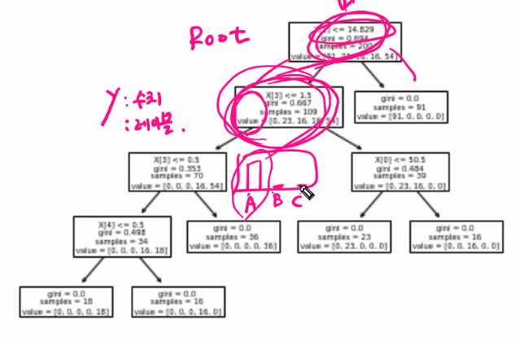

# [ProDS] Associate Grade practice

>  Kdigital develop intelligent service based on Bigdata program

* [SET01-05](./Set01_Set05.py)

## DecisionTree

> 문제2-3

```python
# 1. 변수 변환 (범주형 -> 수치형)
q3 = data2.copy()  # 데이터를 카피함.

q3['Sex_cd'] = np.where(q3.Sex=='M', 0, 1)
q3['BP_cd'] = np.where(q3.BP=='LOW', 0,
                       np.where(q3.BP=='NORMAL', 1, 2))
q3['Ch_cd'] = np.where(q3.Cholesterol=='NORMAL', 0, 1)

# 2. 의사결정나무 모델 적용 : 입력/출력 변수 확인 포함
# 입력 : Age, Na_to_K, Sex_cd, BP_cd, Ch_cd를 Feature로
# 출력 : Drug를 Label
from sklearn.tree import DecisionTreeClassifier, export_text, plot_tree

x_var=['Age', 'Na_to_K', 'Sex_cd', 'BP_cd', 'Ch_cd']
dt = DecisionTreeClassifier().fit(q3[x_var], q3.Drug)

# - random state가 나오는지 확인해야 함.

# 3. Root Node의 split Feature와 split value 찾기
export_text(dt)
plot_tree(dt)
```




* 각각의 단계를 진위와 엔트로피로 설명함.
* 끝단 노드는 잎이 됨.(마지막은 불순도가 없음.)

## 문제 3-2

> t-test, anova?
